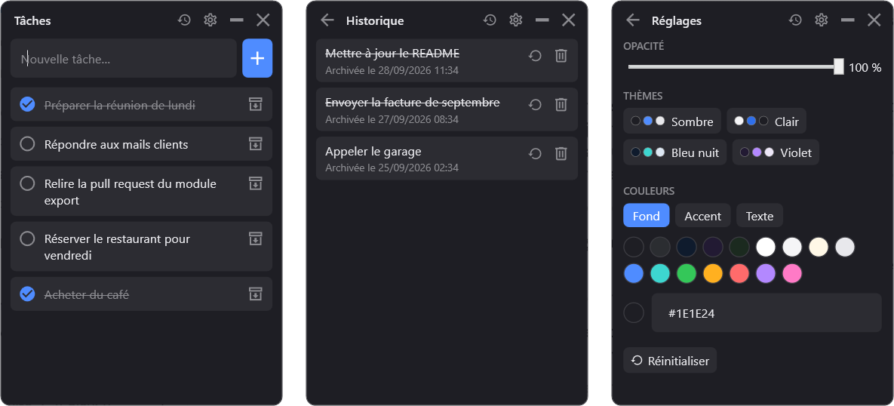

<p align="center">
  
</p>

<h1 align="center">TaskWidget</h1>

<p align="center">
  Une petite to-do list pour Windows, toujours au premier plan, que l'on place où l'on veut sur l'écran.
</p>

<p align="center">
  
</p>

---

## Fonctionnalités

- **Toujours au-dessus** des autres fenêtres, sans bordure, déplaçable et redimensionnable
- **Ajout rapide** : on écrit, on appuie sur Entrée (ou `+`)
- **Valider** une tâche : elle est cochée et barrée (re-cliquer pour annuler)
- **Archiver** une tâche : elle quitte la liste et part dans l'**Historique**
- **Historique** : restaurer une tâche archivée ou la supprimer définitivement
- **Personnalisation** : opacité réglable, 4 thèmes prêts (Sombre, Clair, Bleu nuit, Violet) et couleurs libres (fond, accent, texte)
- **Sauvegarde automatique** à chaque modification, avec copie de secours
- Position, taille et thème mémorisés d'une ouverture à l'autre

## Installation

1. Télécharger `TaskWidget.zip` depuis la page [**Releases**](../../releases/latest)
2. Extraire le dossier où vous voulez
3. Lancer `TaskWidget.exe`. Aucune installation requise, .NET est inclus

> Windows 10/11 64 bits. L'application n'étant pas signée, Windows SmartScreen peut afficher un avertissement au premier lancement : cliquer sur **Informations complémentaires** puis **Exécuter quand même**.

## Données

Les tâches et réglages sont enregistrés dans `%APPDATA%\TaskWidget` :

| Fichier | Contenu |
|---|---|
| `tasks.json` | Les tâches (actives et archivées) |
| `settings.json` | Position, taille, opacité, couleurs |
| `*.bak` | Version précédente, rechargée automatiquement si le fichier principal est illisible |

Ces fichiers sont indépendants de l'exécutable : fermer l'application ou la mettre à jour ne fait rien perdre.

## Compiler depuis les sources

Prérequis : [.NET 9 SDK](https://dotnet.microsoft.com/download/dotnet/9.0).

```bash
cd TaskWidget
dotnet run
```

Pour tester sans toucher à ses propres tâches, on peut pointer l'application vers un autre dossier de données avec la variable d'environnement `TASKWIDGET_DATA_DIR`.

Générer l'exécutable autonome (un seul fichier) :

```bash
dotnet publish TaskWidget -c Release -r win-x64 --self-contained true -p:PublishSingleFile=true -p:IncludeNativeLibrariesForSelfExtract=true -p:EnableCompressionInSingleFile=true -o dist
```

## Technologies

- C# / WPF (.NET 9)
- Icônes : [MahApps.Metro.IconPacks](https://github.com/MahApps/MahApps.Metro.IconPacks) (Material Design)

## Licence

[MIT](LICENSE)
